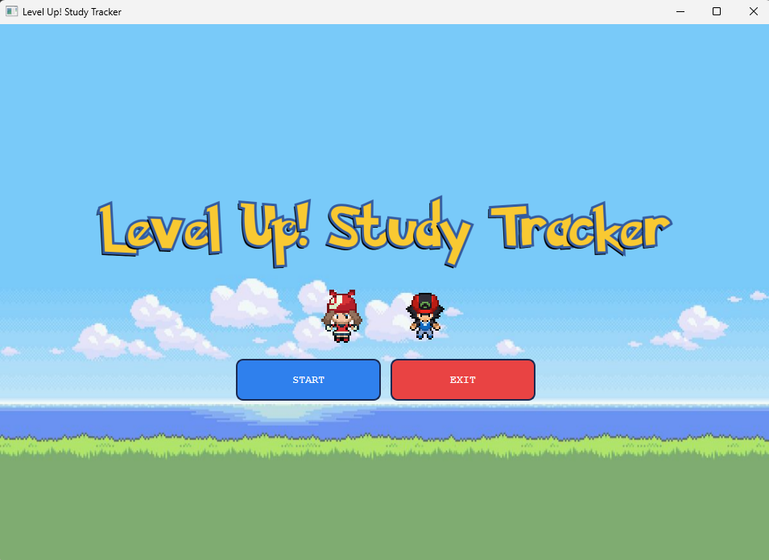
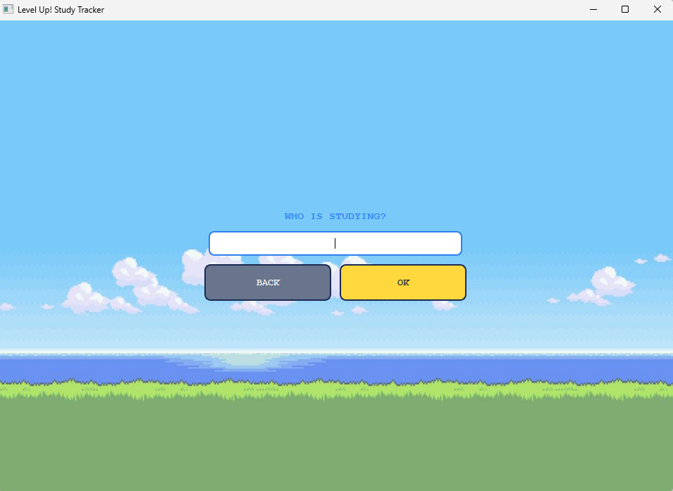
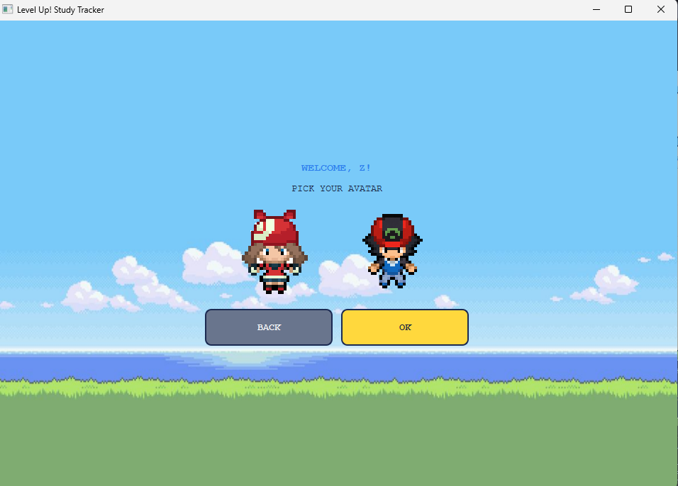
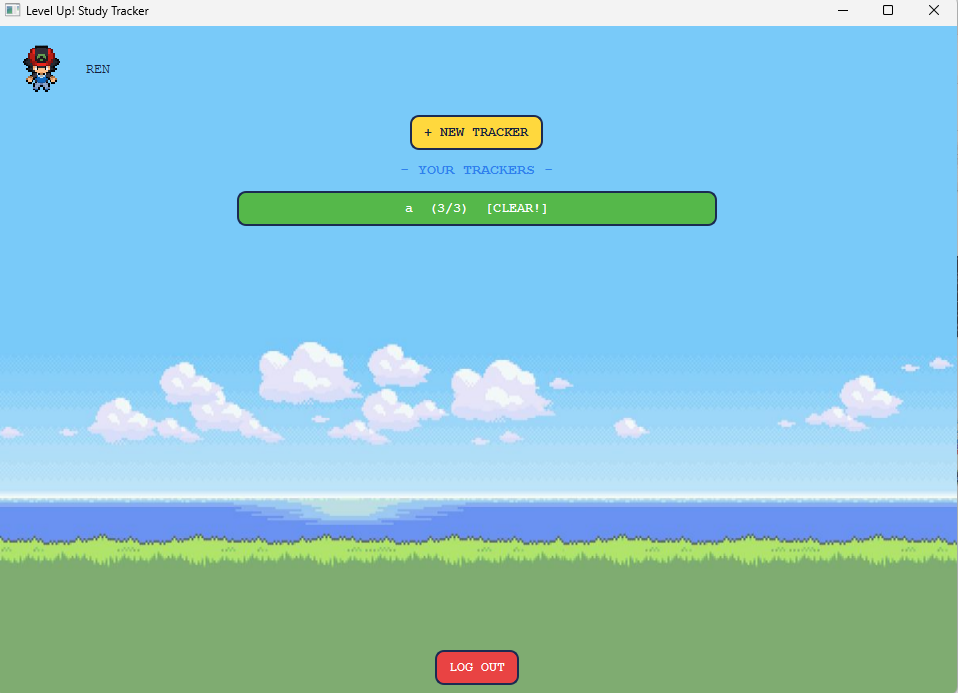
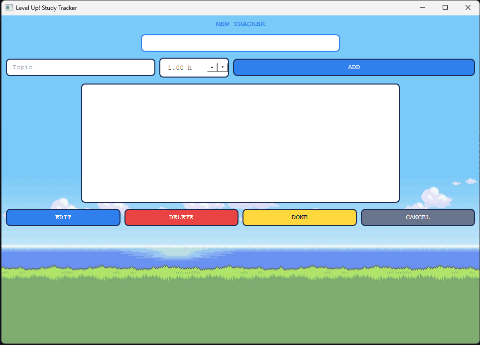
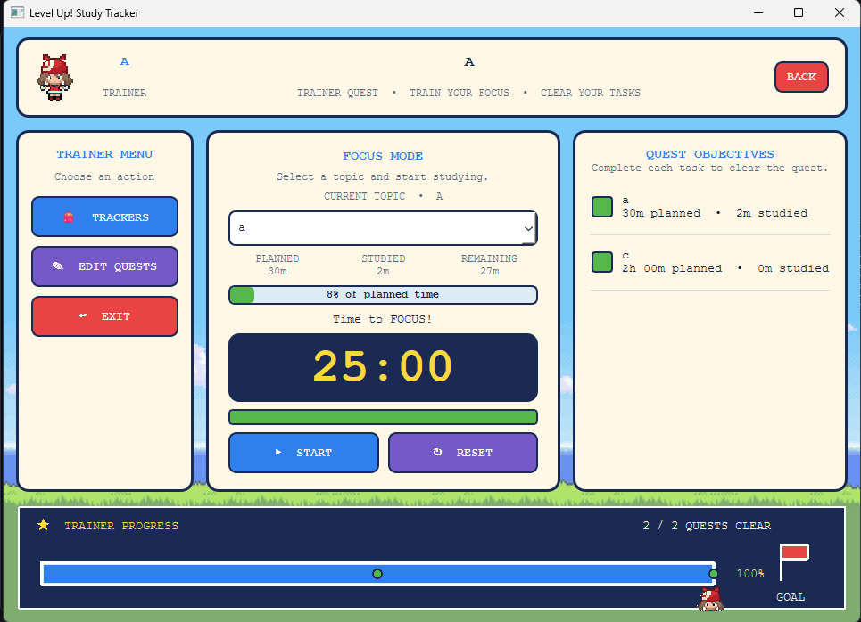
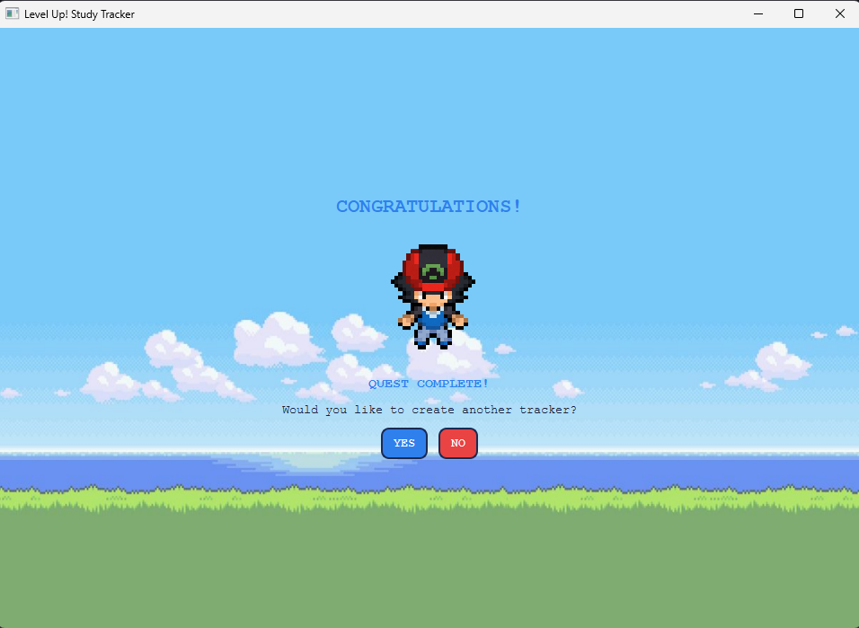

# Title

**LEVEL UP!: Student Study Tracker System**

---

# Description

LEVEL UP! is a desktop application that helps students organize their study topics, manage study trackers, and maintain focused study sessions. The user creates a tracker, adds study topics with planned study time, and the system shows study progress, completed topics, and remaining study time. Trackers and topics can be saved, reopened, edited, and deleted.

The system also includes a Pomodoro-style focus timer, study progress tracking, student avatar selection, a topic checklist, and a game-inspired interface.

**Problem addressed:** Students often have multiple subjects and topics to study but may have difficulty organizing their workload and maintaining focus. Students may also lose track of which topics they have completed and how much time they have spent studying. LEVEL UP! gives students a simple, offline tool that helps them organize study topics, plan study time, focus during study sessions, and monitor their overall progress.

---

# Objectives

- Let students create and manage study trackers.
- Allow students to organize their study workload into individual topics.
- Allow students to assign planned study time to topics.
- Provide CRUD operations for study topics.
- Provide a checklist for completed and incomplete topics.
- Provide a Pomodoro-style focus timer for study sessions.
- Show planned, studied, and remaining study time.
- Display study progress through a visual progress bar.
- Allow students to select a student avatar.
- Store study information using a local SQLite database.
- Make studying more engaging through a game-inspired interface.

---

# Features

| Feature | Description |
|---|---|
| Main menu | Entry screen with **START** and **EXIT**, with a game-inspired interface and application title. |
| Student name | Asks **"Who is studying?"** before starting a study session. |
| Avatar selection | Allows the student to choose between the available boy and girl avatars. |
| Tracker selection | Displays available study trackers and allows the student to create a new tracker. |
| Create tracker | Creates a study tracker for a subject, course, project, or study goal. |
| Add topic | Adds a new study topic and its planned study time. |
| Edit topic | Allows an existing study topic to be modified. |
| Delete topic | Removes a selected study topic from the tracker. |
| Complete topic | Allows the student to mark a study topic as completed. |
| Topic checklist | Displays study topics and their completion status. |
| Focus mode | Provides a dedicated study screen for the selected topic. |
| Pomodoro timer | Provides a focused study timer for study sessions. |
| Start timer | Starts the focus session for the selected study topic. |
| Reset timer | Resets the current focus timer. |
| Planned time | Displays the amount of study time planned for a topic. |
| Studied time | Displays the amount of study time already completed. |
| Remaining time | Shows the remaining planned study time. |
| Study progress | Displays the percentage of planned study time completed. |
| Progress bar | Provides a visual representation of study progress. |
| Quest objectives | Displays the topics that must be completed for the current tracker. |
| Tracker progress | Displays the student's overall progress toward completing the tracker. |
| Multiple trackers | Allows students to maintain different study trackers. |
| Save progress | Stores study tracker information in the local database. |
| Game-inspired interface | Uses pixel-art visuals, avatars, backgrounds, and game-inspired interface elements. |

---

# Technologies Used

- **Programming language:** Python 3.x
- **GUI framework:** PyQt6
- **Database:** SQLite (`sqlite3` module, included with Python)
- **Other libraries and tools:**
  - `PyQt6.QtWidgets` for GUI widgets and layouts
  - `PyQt6.QtCore` for timers, signals, slots, and application logic
  - `PyQt6.QtGui` for fonts, images, icons, and graphical components
  - Pillow for image handling and processing
  - `sqlite3` for SQLite database support
  - `os` and `pathlib` for file and path management
  - Git and GitHub for version control

---

# Project Structure

```text
Python Final Project/
├── .venv/
└── Python Final/
    ├── core/
    │   ├── __init__.py
    │   ├── page.py
    │   ├── service.py
    │   ├── theme.py
    │   ├── widgets.py
    │   └── window.py
    ├── database/
    │   ├── __init__.py
    │   ├── connection.py
    │   └── levelup.db
    ├── features/
    │   ├── pomodoro/
    │   │   ├── __init__.py
    │   │   ├── service.py
    │   │   └── view.py
    │   ├── progress_bar/
    │   │   ├── __init__.py
    │   │   └── view.py
    │   ├── start/
    │   │   ├── __init__.py
    │   │   ├── model.py
    │   │   ├── repository.py
    │   │   ├── service.py
    │   │   └── view.py
    │   ├── student/
    │   │   ├── __init__.py
    │   │   ├── model.py
    │   │   ├── repository.py
    │   │   ├── service.py
    │   │   └── view.py
    │   └── tracker/
    │       └── ...
    ├── images/
    │   ├── background.jpg
    │   ├── boy_avatar.png
    │   ├── girl_avatar.png
    │   └── title.png
    ├── main.py
    └── .gitignore
```

**Purpose of each folder:**

- `core/` holds the shared application components such as pages, services, themes, widgets, and the main window.
- `features/` holds the main features of the study tracker system.
- `features/pomodoro/` holds the Pomodoro focus timer functionality.
- `features/progress_bar/` holds the visual study progress functionality.
- `features/start/` holds the start and tracker creation functionality.
- `features/student/` holds student-related functionality such as the student profile and avatar.
- `features/tracker/` holds the study tracker functionality.
- `database/` holds the SQLite database connection and stored study data.
- `images/` holds the images and visual assets used by the application.
- `main.py` starts the application and connects the different parts of the system.

---

# Installation and Setup

**Requirements:** Windows, Python 3.10 or newer, and Git.

1. Clone the repository:
   ```bash
   git clone https://github.com/raeinwr/Level-Up--Study-Tracker.git
   cd Level-Up--Study-Tracker
   ```

2. Navigate to the application folder:
   ```bash
   cd "Python Final"
   ```

3. Create a virtual environment:
   ```bash
   python -m venv .venv
   ```

4. Activate the virtual environment:
   ```powershell
   .venv\Scripts\Activate.ps1
   ```

5. Install PyQt6:
   ```bash
   pip install PyQt6
   ```

6. Install Pillow:
   ```bash
   pip install Pillow
   ```

7. Run the application:
   ```bash
   python main.py
   ```

The application uses the SQLite database file located at `database/levelup.db`.

**Dependencies:** PyQt6 and Pillow. SQLite and `sqlite3` are included with Python.

---

# How to Use the System

1. Launch the app with `python main.py`.
2. The **LEVEL UP!** main menu appears.
3. Click **START**.
4. Enter the student's name when asked **"Who is studying?"**.
5. Select a student avatar.
6. Choose an existing study tracker or create a **NEW TRACKER**.
7. Enter the required tracker information.
8. Add study topics to the tracker.
9. Enter the planned study time for each topic.
10. Edit or delete topics when necessary.
11. Click **DONE** when the tracker is ready.
12. The study dashboard opens.
13. Select the topic you want to study.
14. Start the Pomodoro focus timer.
15. Monitor the planned, studied, and remaining study time.
16. Use the topic checklist to mark completed topics.
17. Monitor the overall progress using the progress bar.
18. Complete the study objectives.
19. Use **RESET** when the focus timer needs to be restarted.
20. Use **BACK** to return to the previous screen.
21. Use **EXIT** to close the application.

---

# OOP Implementation

## Important classes and objects

| Class / Component | File | Role |
|---|---|---|
| `Service` | `core/service.py` | Provides shared application services |
| `Theme` | `core/theme.py` | Holds the application's colors, fonts, and styling |
| `Widgets` | `core/widgets.py` | Provides reusable custom UI widgets |
| `Window` | `core/window.py` | Handles the main application window |
| Database Connection | `database/connection.py` | Handles SQLite database connections and operations |
| Pomodoro Service | `features/pomodoro/service.py` | Handles Pomodoro timer logic |
| Pomodoro View | `features/pomodoro/view.py` | Displays the Pomodoro timer |
| Progress Bar View | `features/progress_bar/view.py` | Displays study progress |
| Start Model | `features/start/model.py` | Represents start-related data |
| Start Repository | `features/start/repository.py` | Handles start-related data operations |
| Start Service | `features/start/service.py` | Handles start-related application logic |
| Start View | `features/start/view.py` | Displays the start interface |
| Student Model | `features/student/model.py` | Represents student-related data |
| Student Repository | `features/student/repository.py` | Handles student data operations |
| Student Service | `features/student/service.py` | Handles student-related application logic |
| Student View | `features/student/view.py` | Displays the student interface |
| Tracker Components | `features/tracker/` | Handles study tracker functionality |

## Where the OOP concepts are applied

- **Encapsulation:**
  - Related data and behavior are grouped into classes and modules.
  - Student, tracker, Pomodoro, and database functionality are separated into their respective components.
  - Database operations are kept inside the database and repository layers.
  - Services handle application logic instead of placing all logic inside the graphical interface.
  - Reusable widgets keep their own UI-related behavior.

- **Inheritance:**
  - Custom PyQt6 pages and widgets inherit functionality from PyQt6 classes.
  - Application components extend existing Qt classes while adding functionality specific to LEVEL UP!.
  - This allows the project to reuse functionality provided by the PyQt6 framework.

- **Polymorphism:**
  - Different application views can provide their own implementations while following shared structures.
  - Different PyQt6 widgets share common parent behavior while performing different tasks.
  - Services and views can interact through shared structures and methods.

- **Composition:**
  - Larger application screens are created by combining smaller components.
  - The dashboard combines the Pomodoro timer, progress bar, topic checklist, labels, buttons, and study information.
  - Features are composed of models, repositories, services, and views.

- **Abstraction:**
  - Database operations are separated from the graphical interface.
  - Services hide application logic from the user interface.
  - The Pomodoro view uses timer functionality without needing to handle every internal timer operation.
  - Repository classes provide an abstraction between application logic and the database.

---

# Database

## Structure

SQLite database file: `database/levelup.db`.

**Database connection:** `database/connection.py`

The application uses SQLite for local persistent storage of study tracker information.

The database stores information related to the student's study trackers, topics, completion status, and study progress.

**Database architecture:**

```text
Application
     │
     ▼
Feature Views
     │
     ▼
Services
     │
     ▼
Repositories
     │
     ▼
Database Connection
     │
     ▼
SQLite
     │
     ▼
levelup.db
```

## Database operations and where the app uses them

| Operation | Location | Used by | Description |
|---|---|---|---|
| Create | `database/connection.py` | Tracker and topic creation | Inserts new study tracker and topic information into the database. |
| Read | `database/connection.py` | Tracker and dashboard screens | Retrieves saved trackers, topics, and study information. |
| Update | `database/connection.py` | Tracker and topic management | Updates existing tracker, topic, completion, and study-time information. |
| Delete | `database/connection.py` | Tracker and topic management | Deletes selected study trackers or topics from the database. |

The database and repository layers keep SQL and database operations separate from the graphical interface. This allows the application to access stored information without requiring the UI to directly manage database connections.

---

# Screenshots

| Screenshot | Description |
|---|---|
|  | **Main Menu:** Starting screen containing the LEVEL UP! title and main navigation controls. |
|  | **Student Profile:** Screen where the student's name is entered. |
|  | **Avatar Selection:** Allows the student to choose an available avatar. |
|  | **Trackers:** Displays the available study trackers. |
|  | **Topics:** Displays and manages the study topics for the selected tracker. |
|  | **Dashboard:** Displays study topics, study progress, timer, and tracker information. |
|  | **Completion:** Displays the completion state after the study objectives are finished. |

---

# Testing

| # | Test | Input | Expected result | Actual result |
|---|---|---|---|---|
| 1 | Launch application | Run `python main.py` | Main menu appears | Main menu appears |
| 2 | Start application | Click **START** | Student screen appears | Student screen appears |
| 3 | Enter student name | Enter a valid name | Student name is accepted | Student name accepted |
| 4 | Empty student name | Leave name empty | Input is handled appropriately | Input handled |
| 5 | Select boy avatar | Click boy avatar | Boy avatar is selected | Boy avatar selected |
| 6 | Select girl avatar | Click girl avatar | Girl avatar is selected | Girl avatar selected |
| 7 | Open tracker screen | Continue after avatar selection | Tracker screen appears | Tracker screen appears |
| 8 | Create tracker | Enter tracker information | New tracker is created | Tracker created |
| 9 | Add topic | Enter topic and planned study time | Topic appears in the tracker | Topic added |
| 10 | Edit topic | Select and edit a topic | Topic information is updated | Topic updated |
| 11 | Delete topic | Select and delete a topic | Topic is removed | Topic removed |
| 12 | Complete topic | Mark a topic as completed | Topic completion status changes | Status updated |
| 13 | Open dashboard | Finish tracker setup | Dashboard appears | Dashboard appears |
| 14 | Start Pomodoro timer | Click **START** | Timer begins counting | Timer starts |
| 15 | Reset Pomodoro timer | Click **RESET** | Timer returns to its starting state | Timer resets |
| 16 | Study progress | Spend study time on a topic | Studied time and progress update | Progress updates |
| 17 | Remaining time | Complete part of planned study time | Remaining time decreases | Remaining time updates |
| 18 | Topic checklist | Complete a study topic | Topic is marked completed | Topic completed |
| 19 | Progress bar | Increase study progress | Progress bar updates visually | Progress bar updates |
| 20 | Multiple trackers | Create or select another tracker | Correct tracker is displayed | Tracker displayed |
| 21 | Save information | Save tracker information | Study information is stored in SQLite | Data stored |
| 22 | Reload application | Close and reopen application | Previously saved information remains available | Saved information remains available |
| 23 | Exit application | Click **EXIT** | Application closes | Application closes |

---

# Known Issues / Limitations

- The application is designed primarily as a single-user desktop application.
- Study information is stored locally using SQLite.
- There is currently no cloud synchronization.
- There is no online account or authentication system.
- The application is intended for desktop use.
- UI scaling may vary depending on screen resolution and display settings.
- The available avatars are limited to the included image assets.
- The application depends on the image files inside the `images/` folder.
- The Pomodoro timer cannot verify whether the student is actually studying during a session.
- Advanced study analytics are not currently included.
- There is no cloud backup system.
- There is no online synchronization between devices.
- The system currently focuses on study tracking, topic organization, focused study sessions, and progress monitoring.
- The application requires the correct image assets to be available for the interface to display properly.
- The system does not currently support multiple users simultaneously.

**Possible future work:** study streaks, XP and leveling systems, achievements, additional avatars, customizable Pomodoro timers, detailed study statistics, study calendars, reminders, cloud synchronization, data export, search and filtering, notifications, and more advanced learning analytics.

---

# Author

- **Name:** *Carenne Ryssa C. Wong*
- **Section:** *CS26L(3581)*
